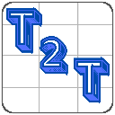
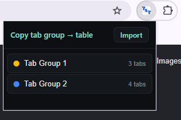
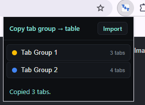
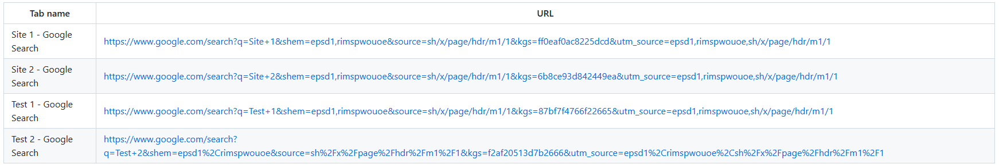
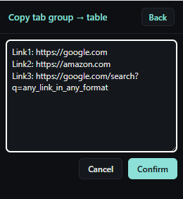
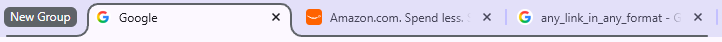

<div align="center">



# Ty10y's Tab-to-Table

**Copy any Chrome tab group into a clean table of links — then paste a table (or any text with links) right back in as a new tab group.**

No accounts, no exports, no JSON. Just names and links.

</div>

---

## What it does

Tab-to-Table works in two directions:

- **Copy → Table.** Pick a tab group and it's copied to your clipboard as a table with a **Tab name** column and a **URL** column. You get both a rich **HTML table** (paste into Docs, email, Notion, etc.) and a **Markdown table** (paste into GitHub, chats, editors) at the same time.
- **Table → Tabs.** Open the **Import** view, paste a table — or honestly any text containing links — and it pulls out every `http(s)` link, opens each in a background tab, and bundles them into a new tab group.

Because the format is just "names and links," a shared table is readable by anyone and survives being pasted through almost anything.

## Screenshots

> The images below live in [`docs/screenshots/`](docs/screenshots).

### The popup — your tab groups, one click to copy
Each group shows its color, name, and tab count.



### Copy a group → table
Clicking a group copies it and confirms with a status message.



The result pastes as a real table wherever you drop it:



### Import: paste a list, get a tab group back
Paste a table or any text with links…



…and Confirm reopens them all as a new group:



## Install

### From source (unpacked)

1. Download or clone this repository.
2. Go to `chrome://extensions`.
3. Turn on **Developer mode** (top-right).
4. Click **Load unpacked** and select the repository folder (the one containing `manifest.json`).

### Packaged build

A packaged build is available at [`build/ty10ys_T2T_1.2.0.crx`](build/ty10ys_T2T_1.2.0.crx). Note that Chrome restricts installing `.crx` files from outside the Chrome Web Store; loading unpacked (above) is the reliable route for local use.

## Usage

**To copy a group as a table:**
1. Click the Tab-to-Table icon.
2. Click any tab group in the list. It's now on your clipboard as both HTML and Markdown — paste anywhere.

**To import links as a group:**
1. Click the icon, then **Import**.
2. Paste a table or any text containing links.
3. Click **Confirm**. The links open as background tabs in a new group named **"New Group"**.

## How it works

The extension is intentionally tiny — a popup and a script, no background service worker or content scripts.

| File | Role |
| --- | --- |
| [`manifest.json`](manifest.json) | Manifest V3 config; requests the `tabs` and `tabGroups` permissions. |
| [`popup.html`](popup.html) | The dark-themed popup UI: group list + import view. |
| [`popup.js`](popup.js) | All logic — reads tab groups, builds HTML/Markdown tables, writes to the clipboard, and parses pasted links back into a new group. |
| [`icon.png`](icon.png) | Toolbar / store icon. |

**Export** uses `chrome.tabGroups.query` + `chrome.tabs.query` to read the current window's groups, then `navigator.clipboard.write` to place both a `text/html` and a `text/plain` (Markdown) representation on the clipboard (falling back to Markdown-only if rich write is blocked).

**Import** extracts unique `http(s)` URLs with a regex, trims common trailing punctuation, creates a background tab per link, and calls `chrome.tabs.group` to bundle them.

## Permissions

| Permission | Why |
| --- | --- |
| `tabs` | Read tab titles/URLs to build the table, and create tabs on import. |
| `tabGroups` | List tab groups and create/name a group on import. |

The extension does not use the network, has no analytics, and stores no data — everything happens locally through the clipboard and your open tabs.

## Project layout

```
.
├── manifest.json            # MV3 manifest
├── popup.html               # Popup UI
├── popup.js                 # Copy + import logic
├── icon.png                 # Icon
├── build/
│   └── ty10ys_T2T_1.2.0.crx # Packaged build
├── marketing/
│   └── TabtoTable_Promo.dc.html  # Promo / store-asset design doc
└── docs/
    └── screenshots/         # README images
```

## Version

Current version: **1.2.0**

## License

Released under the [GNU General Public License v3.0](LICENSE).
